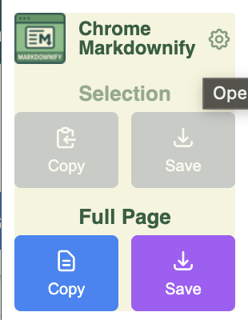

# Chrome Markdownify

Convert and copy web pages to Markdown format in just two clicks. Perfect for sharing content with LLMs, note-taking apps, and documentation workflows.

## Features

- **One-click conversion**: Copy entire web pages or selected text as clean Markdown
- **Multiple access methods**: Browser extension popup, context menus, and toolbar icon
- **Smart clipboard handling**: Automatic truncation for large content with file download fallback
- **LLM-friendly output**: Clean, well-formatted Markdown optimized for AI consumption
- **Metadata preservation**: Includes source URL and capture timestamp
- **Error handling**: Graceful handling of restricted pages and network issues

## Installation

### Quick Install (Recommended)

1. Download the latest release from the [Releases page](https://github.com/YOUR_USERNAME/chrome-markdownify/releases)
2. Download the `chrome-markdownify-vX.X.X.zip` file
3. Open Chrome and navigate to `chrome://extensions/`
4. Enable "Developer mode" in the top right corner
5. Drag and drop the ZIP file onto the page, or:
   - Extract the ZIP file to a folder
   - Click "Load unpacked" and select the extracted folder
6. The extension icon should appear in your toolbar

### Build from Source

For developers who want to build from source, see [DEVELOPER.md](DEVELOPER.md).

## Usage

### Method 1: Context Menus

- Right-click anywhere on a webpage and select "Copy page as Markdown"
- Select text, then right-click and choose "Copy selection as Markdown"

### Method 2: Extension Popup

1. Click the Chrome Markdownify icon in your browser toolbar
2. Choose from the available options:
   - **Copy Full Page**: Converts the entire visible webpage to Markdown
   - **Copy Selection**: Converts only selected text (disabled if no selection)
   - **Settings**: Opens the extension options page (currently minimal)

### Supported Content

- Text content and formatting (headings, paragraphs, lists, emphasis)
- Tables (converted to GitHub Flavored Markdown format)
- Code blocks with language detection
- Images with alt text and captions
- Links (both inline and reference style)

## Troubleshooting

### Extension Not Working

1. **Refresh the page** after installing the extension
2. **Check permissions**: Ensure the extension has access to the current site
3. **Reload extension**: Go to `chrome://extensions/`, find Chrome Markdownify, and click the reload icon
4. **Check console**: Open Developer Tools (F12) and look for error messages

### Large Content Issues

- Content over 50KB is automatically truncated with a warning message
- Very large content (>1MB) may trigger a file download instead of clipboard copy
- If clipboard fails, the extension will attempt to offer a file download

### Formatting Issues

- Some complex layouts may not convert perfectly
- Dynamic content loaded by JavaScript might not be captured
- Try selecting specific content instead of converting the full page

### Browser Compatibility

- Designed for Chrome and Chromium-based browsers
- Requires Chrome Extensions Manifest V3 support
- Modern JavaScript features require recent browser versions

## Contributing

We welcome contributions! Please see [DEVELOPER.md](DEVELOPER.md) for development setup and guidelines.

## License

This project is licensed under the MIT License - see the LICENSE file for details.
